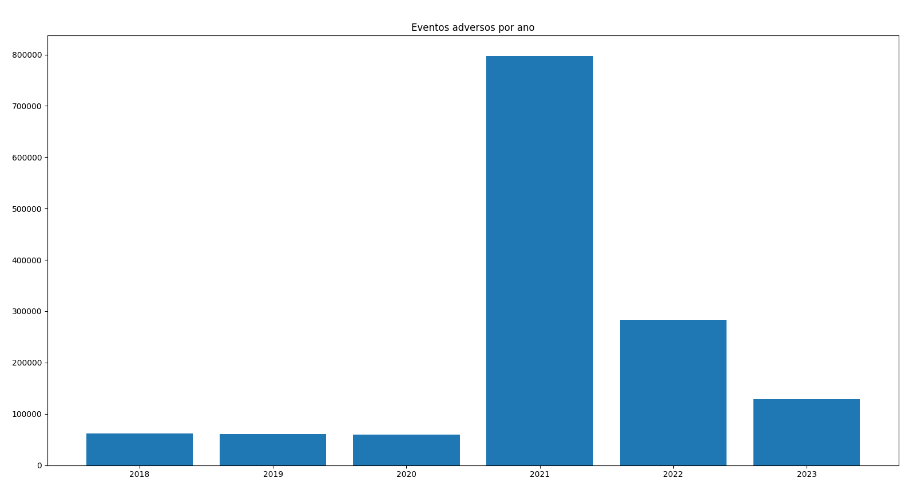
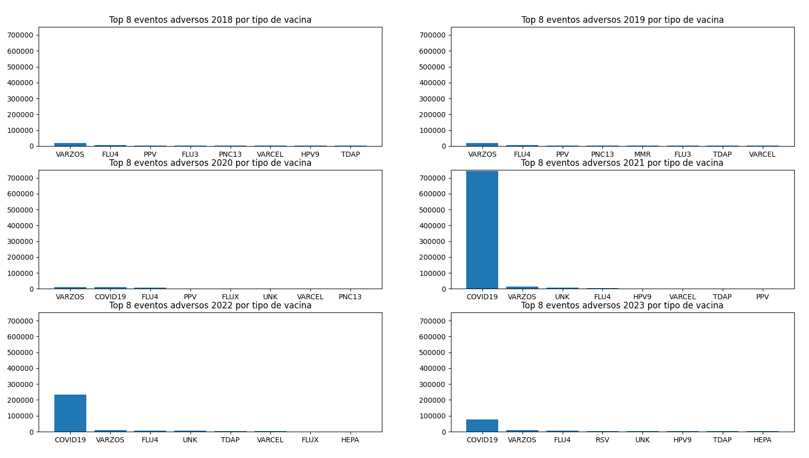
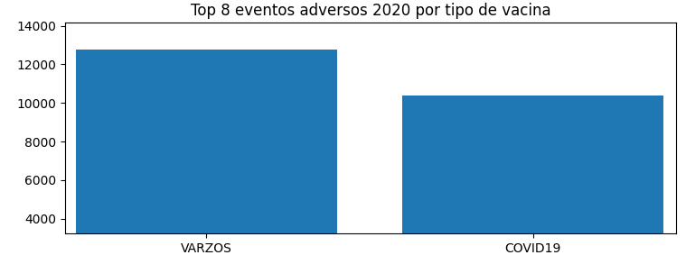
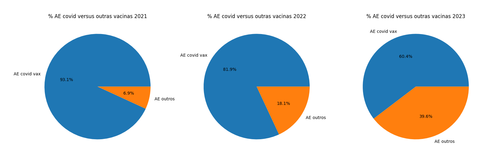

# Estudo sobre reações adversas a vacinações

Um estudo de caso sobre eventos adversos da vacinação de covid em comparação com outras vacinas.
A fonte dos datasets utilizados é o [VAERS](https://vaers.hhs.gov/data/datasets.html), Vaccine Adverse Event Reporting System, ou Sistema de Notificação de Eventos Adversos de Vacinas em português, uma base de dados do governo norte americano que compila reações adversas de diversas vacinas desde 1990. As URLs de cada dataset indivual estão no código fonte.

## Motivação

Vi muitas pessoas debatendo se a vacinação contra Covid é "arriscada", ou com riscos acima do "normal" e decidi fazer este simples levantamento utilizando esta fonte de dados oficial.

## Observações

Este **não** é um estudo científico e minha intenção não é levantar teorias da conspiração. Apenas observar o que os dados oficiais nos mostram.
Entende-se por Reação Adversa (AE) qualquer efeito colateral leve ou grave, fatal ou não em decorrência ou causada por vacinação. Os dados não distinguem o tipo de reação adversa mas apenas se houve ou não um evento deste tipo.

Os dados devem ser interpretados com cuidado conforme explicado no próprio manual de dados deste órgão, disponível [neste link](https://vaers.hhs.gov/docs/VAERSDataUseGuide_en_September2023.pdf), já que não existe uma correlação certeira entre o evento adverso e a própria vacinação. A maioria dos eventos adversos, entre 85 e 90 porcento em média são pequenos eventos como por exemplo dores de cabeça. Outros 10% referem-se a eventos mais graves que incluem hospitalização, doenças que arriscam a vida do paciente e até morte diretamente. Tudo isto está explicado no manual citado acima.

## Resultados

### Eventos adversos por ano

O número de casos reportados de AE multiplicou 13 vezes de 2020 para 2021. A vacinação contra covid se iniciou em dezembro de 2020 e foi mais intensa em 2021. Com isso os números de eventos adversos de vacinação reportados subiram de cerca de 60.000 por ano em 2020 para quase 800.000 em 2021. Um aumento de aproximadamente 1300%. Em 2022 e 2023 o número de vacinações caiu pois muitas pessoas já haviam se vacinado e não sentiram necessidade de tomar doses de reforço. No entanto, ainda no final de 2023 o número de AEs ainda estava mais que o triplo do reportado no final de 2019.

### Eventos adversos por tipo de vacina por ano (2018-2023)

Os gráficos deixam bem evidente uma discrepância entre os AE da vacina contra Covid19 e a vacina que antes era a que mais reportava AEs (Varicella-Zoster ou VARZOS no gráfico). Selecionei apenas as 8 vacinas que mais tiveram eventos adversos neste intervalo de tempo. Coloquei a escala de número de AEs variando de 0 a 750.000 para que se mostre gráficamente a grande diferença de casos de AEs entre estas vacinas.

Uma informação curiosa é, dado que a vacinação contra Covid19 se iniciou em dezembro de 2020, apenas neste mês deste ano já ocorreram um número de eventos adversos bem próximo do número de eventos adversos para todo o ano para a vacina contra Varicella-Zoster. Ou seja, durante todo o ano de 2020, a vacina que mais reportou eventos adversos foi a VARZOS com cerca de 12.000 reações enquanto apenas em dezembro deste ano o número de reações pela vacina de Covid19 já chegou perto desde número com pouco mais de 10.000 casos reportados.

### Porcentagem de AEs da vacina de Covid19 versus outras vacinas

Durante o ano de 2021, ano em que mais se vacinou contra Covid19, as reações adversas contra apenas este tipo de vacina corresponderam a 93,1% de todas as reações adversas enquanto as outras 68 vacinas corresponderam a apenas 6,9%. Nos anos seguintes, já que se vacinou menos contra a Covid19 também houve uma diminuição da proporção de reações adversas, no entanto, apenas um tipo de vacina continuou correspondendo a mais da metade de todos as AEs. Sendo 2022 81,9% contra 18,1% e 2023 60,4% contra 39,6%.

